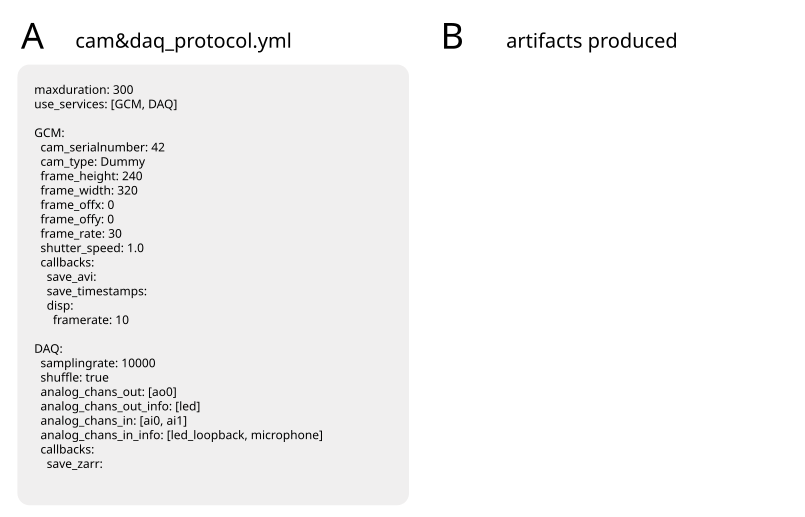

# Summary

`etho` is an open-source Python package for running behavioral neuroscience experiments that require coordinated stimulus presentation, hardware control, and data acquisition. It was developed for experiments in acoustic communication and social behavior, where investigators often need to synchronize sound playback, analog and digital input/output, video acquisition, optogenetic stimulation, environmental monitoring, and external imaging systems. The package is user friendly and can be set up and used w/o any programming skills.  It provides both a command-line interface and a graphical user interface for initializing configuration files, selecting experimental protocols and stimulus playlists, running experiments, and logging acquired data.

The central use case for `etho` is a laboratory experiment in which multiple devices must operate together with reproducible timing. For example, an experiment can play calibrated acoustic and optogenetic stimuli through National Instruments data-acquisition hardware, record multi-channel microphone and trigger signals, acquire synchronized camera frames, and send control pulses to external systems such as ScanImage [@Pologruto_2003_scanimage]. Experimental logic is specified in human-readable YAML protocol files and tabular stimulus playlists. This separates the scientific design of an experiment from lower-level device code and makes experiments easier to inspect, modify, archive, and reproduce.

# Statement of need

Behavioral neuroscience increasingly relies on experiments that combine controlled sensory stimulation, high-speed video, electrophysiology, optical imaging, optogenetics, and environmental monitoring. Commercial acquisition programs and vendor-specific camera or data-acquisition tools can control individual devices, but they are often poorly suited for experiments that require flexible coordination across heterogeneous hardware. Conversely, custom scripts can be flexible but are difficult to reuse across rigs, users, and projects, especially when experiments require several asynchronous data streams and precise logging of stimulus identity, timing, and metadata.

`etho` addresses this gap for laboratories that need a configurable, Python-based framework for multi-device behavioral experiments. The target users are researchers who run repeated experimental protocols across one or more rigs and want the flexibility of a programmable system without embedding all experimental logic directly in scripts. In `etho`, experimental protocols define which services are active, which hardware parameters are used, and which callbacks save or display data. Stimulus playlists define trial structure, stimulus identity and parameters. This design supports systematic variation of stimulus conditions while keeping hardware settings, calibration information, and acquired data tied to the experiment.

# State of the field

Several open-source systems support behavioral experiment control. Bonsai provides a visual programming environment for asynchronous acquisition, online processing, and closed-loop control of data streams [@Lopes_2015_bonsai]. pyControl provides a Python-based system for specifying behavioral tasks as state machines on microcontroller hardware, with a GUI for running many setups in parallel [@Akam_2022_pycontrol]. Autopilot focuses on distributed behavioral experiments using networked Raspberry Pis [@Saunders_2022_autopilot]. Bpod is widely used for temporally precise behavioral control in trial-based rodent tasks, particularly through microcontroller-based state machines [@Solari_2018_bpod]. PsychoPy provides a mature platform for stimulus presentation, especially in psychophysics and human behavioral experiments [@Peirce_2019_psychopy].

`etho` is complementary to these tools. Its niche is not to replace a state-machine controller, a visual data-flow language, or a psychophysics stimulus engine. Instead, it provides a pragmatic Python framework for coordinating heterogeneous laboratory hardware through service processes, YAML protocols, tabular stimulus playlists, callbacks for saving or displaying acquired data, and service-level logs. This structure is useful for behavioral experiments in which stimulus generation, analog/digital acquisition, camera recording, and external triggers must be combined while retaining direct Python-level control and support for lab-specific hardware extensions. The build-versus-contribute justification is therefore architectural: `etho` packages a recurring laboratory pattern --- multi-service coordination around protocol, playlist, calibration, and log files --- rather than adding another device driver to an existing framework.

# Software design

`etho` is organized around services, protocols, playlists, callbacks, and per-service logs \autoref{fig:flow}. Services encapsulate hardware-specific functionality. Current service classes include support for multiple camera backends, National Instruments data-acquisition boards, sound playback, optogenetic LED control, environmental monitoring, DLP-projector stimulation, and remote control of ScanImage calcium imaging rigs. Services can be selected in a protocol file, allowing a single installation to support multiple rigs and experiment types.

Protocols are YAML files that define the structure of an experiment. A protocol specifies the experiment duration, active services, service-specific configuration and callbacks \autoref{fig:protocol}. For example, a protocol can configure a camera service with frame rate, region of interest, exposure, and video-saving callbacks, while also configuring a data-acquisition service with sampling rate, analog input channels, analog and digital output channels, and callbacks for Zarr data storage. Because protocols are plain text, they can be version controlled and stored alongside data and analysis code.

This modular service-plus-protocol structure makes `etho` easily extensible: New hardware can be added as new python classes implementing the service interface and registering a new service. The new service can then be added to a protocol and used in an experiment.

Stimulus playlists are tabular files that define trial sequences. They can reference fixed, external waveform files or simple runtime-generated stimuli, such as sinusoids, optogenetic LED pulse trains, hardware clock signals, and hardware trigger pulses. Playlists support multi-channel stimulation by specifying one stimulus per output channel, with per-channel parameters. Speaker and LED calibration files convert requested stimulus intensities into device-specific output amplitudes, helping preserve quantitative stimulus control across rigs.

Callbacks process data produced by services and are specified in the protocols. Camera services can display frames, save video, and save timestamps; data-acquisition services can save analog data or plot traces. In addition, `etho` writes separate logs for each service, recording service-specific events, parameters, warnings, and errors during an experiment. These logs provide an audit trail for diagnosing hardware or timing problems and help connect acquired data to the processes that produced them. The callback and logging mechanisms separate data acquisition, online monitoring, and experiment provenance from lower-level hardware control code.

Services and callback run in independent processes, thus making use of modern, multi-core hardware. This is what makes `etho` fast, enabling things like precise synchronized stimulus presentation and realtime, high-speed video compression using GPUs.

`etho` favors transparent, file-based configuration, modular service processes, and explicit service-level logging over a monolithic experiment script. This makes the system more inspectable and reusable across rigs while encouraging reproducibility through explicit protocol and playlist files. The resulting trade-off supports reproducibility, traceability, debugging, and long-term maintainability.

# Research impact

`etho` has been developed and used in the Roemschied, Deutsch, and Clemens laboratories to run behavioral neuroscience experiments on acoustic communication, sensory stimulation, and social behavior [@Vijendravarma_2022_drosophila; @Steinfath_2025_neural; @Palacios_2025_drosophila; @RavindranNair_2026_sexspecific]. Its documentation includes installation instructions, protocol and playlist formats, GUI and command-line usage, and API references, making the software user-friendly and widely usable.

The near-term scholarly value of `etho` lies in making complex experiments reproducible. By collecting different elements --- configuration, acquired data. log files --- into versionable files and a reusable Python package, `etho` reduces dependence on one-off scripts and supports more transparent methods reporting.

# Example
TODO:
- example protocol and playlist
- GUI screenshot and terminal commands
- files produced (with link for download - check loading with xb works)

# Acknowledgements

We thank all past and current members of the Clemens lab for testing `etho` on experimental rigs and reporting bugs. Development of `etho` was funded via an Emmy Noether Grant (Project number 329518246) and an ERC Starting Grant (Grant agreement No. 851210) to JC.

# References